# 🧾 JournaStage

> **JournaStage** est une application **web PHP** de **gestion des comptes rendus**, développée dans le cadre du **BTS SIO – option SLAM**.  
> Elle permet aux étudiants de rédiger, déposer et suivre leurs comptes rendus, tandis que les enseignants disposent d’un espace dédié pour consulter et encadrer les travaux de leurs étudiants, le tout via une interface moderne et intuitive.

---

## ✨ Fonctionnalités principales

- 🔐 **Authentification sécurisée des utilisateurs**
- 🧑‍🎓 **Espace étudiant**
  - Rédaction et dépôt des comptes rendus en ligne
  - Consultation des rapports déjà créés
  - Modification ou suppression d’un compte rendu existant
- 👩‍🏫 **Espace enseignant**
  - Consultation de la liste des étudiants et de leurs rapports
  - Visualisation des étudiants appartenant uniquement à leurs classes
- 🧾 **Gestion académique**
  - Gestion des classes et établissements
  - Association entre les enseignants et les classes
- 📬 **Formulaires intégrés**
  - Formulaire de contact
  - Formulaire de demande de création de compte, transmis aux administrateurs (aucune inscription directe possible)
- 🔑 **Sécurité avancée**
  - Réinitialisation de mot de passe avec génération automatique d’un mot de passe temporaire
  - Obligation de le modifier lors de la première reconnexion
- 🗄️ **Connexion sécurisée** à une base de données **MySQL**

---

## 🧰 Technologies utilisées

- **Langage principal :** PHP
- **Architecture :** MVC (Model-View-Controller)
- **Base de données :** MySQL
- **Sécurité :** hachage des mots de passe
- **Front-end :** HTML, CSS, JavaScript
- **Serveur :** Apache2

---

## 🧱 Architecture technique

L’application repose sur une structure **MVC modulaire** :

- **Model** : gestion des entités (utilisateurs, rapports, classes, écoles…)
- **View** : pages dynamiques PHP avec CSS personnalisé
- **Controller** : logique métier et gestion des routes
- **Core** : services internes (authentification, sessions, configuration, etc.)

---

## 🗄️ Base de données

### Tables principales :

- `USER`
- `REPORT`
- `CLASS`
- `SCHOOL`
- `TEACH`
- `SESSION`

### Schéma relationnel :

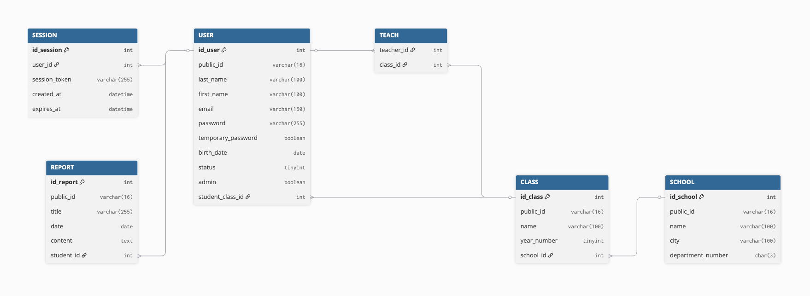

---

## 🎥 Démonstration

Une **version en ligne** du projet est disponible :  
🔗 [journastage.camillefezandelle.cloud](https://journastage.camillefezandelle.cloud)

**Comptes de test pour la démo :**

```
Étudiant :
email : etudiant@gmail.com
mot de passe : Password123=

Enseignant :
email : prof@gmail.com
mot de passe : Password123=
```

---

## 📸 Captures d’écran

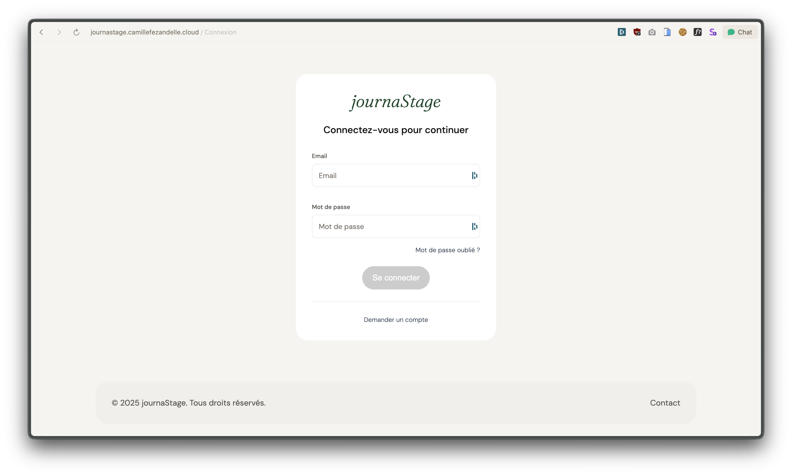
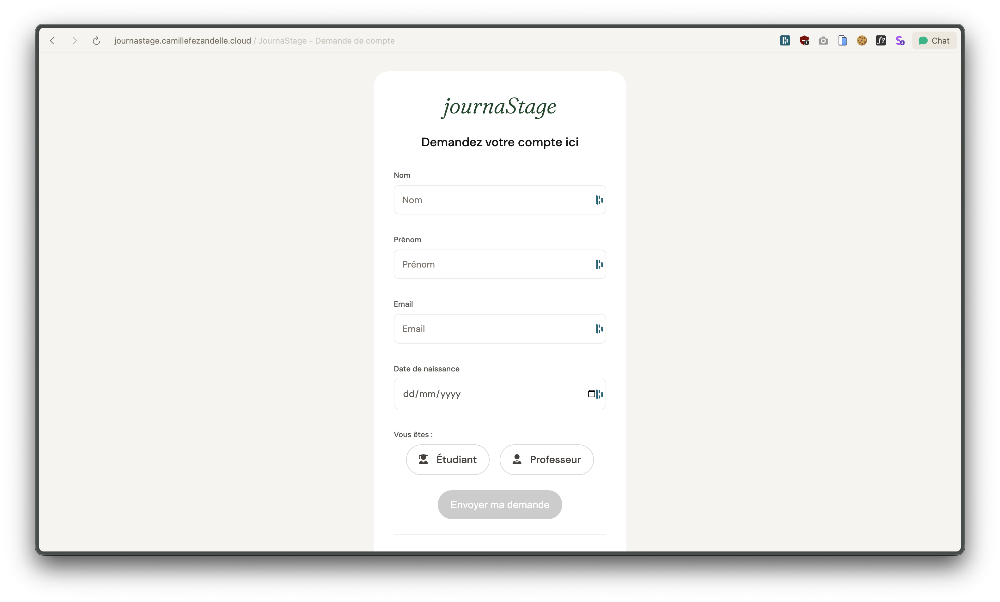
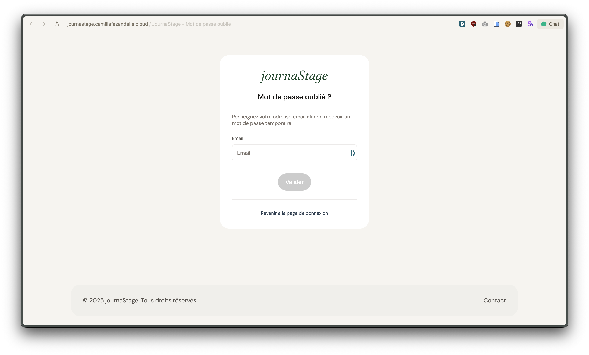
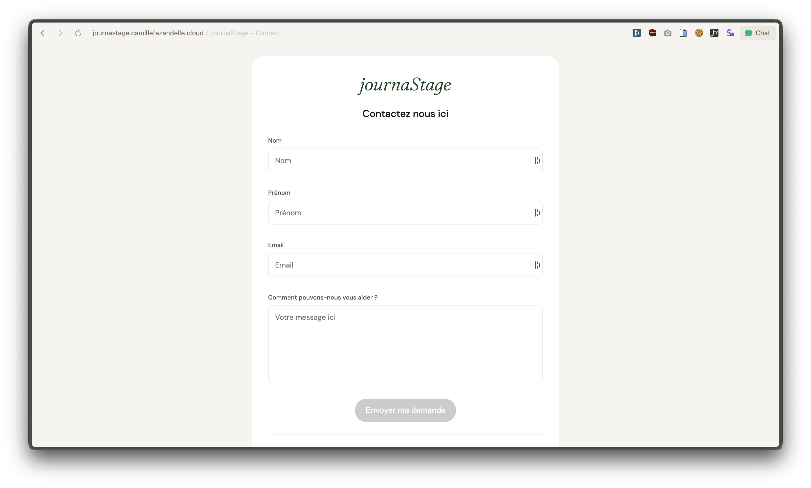
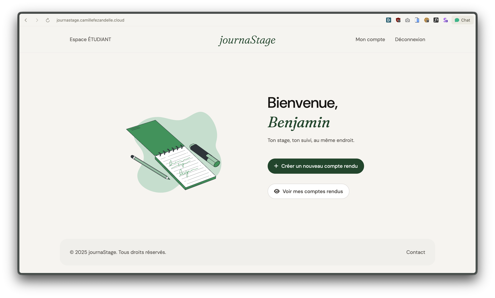
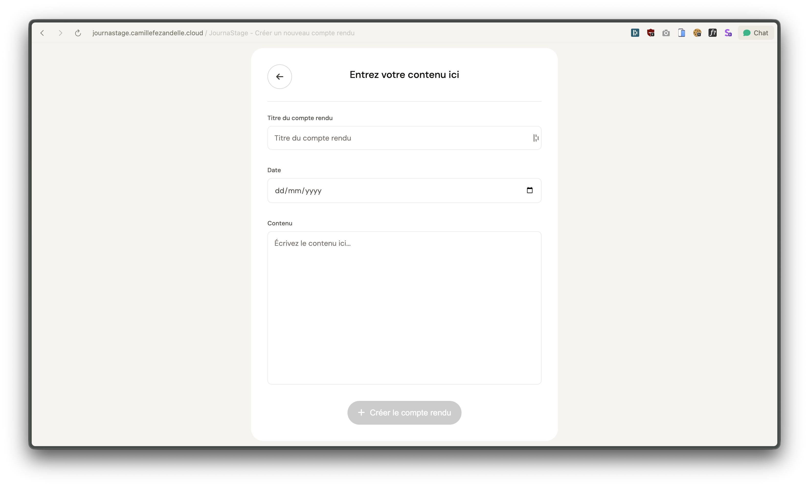
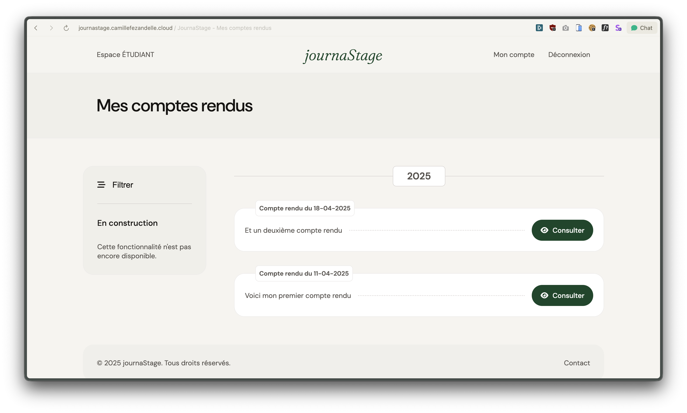
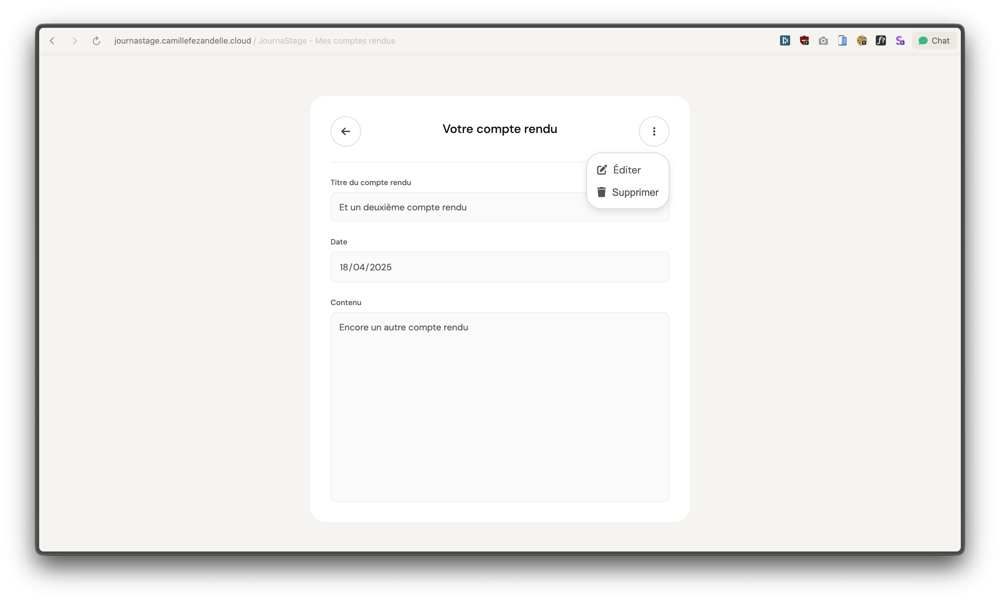
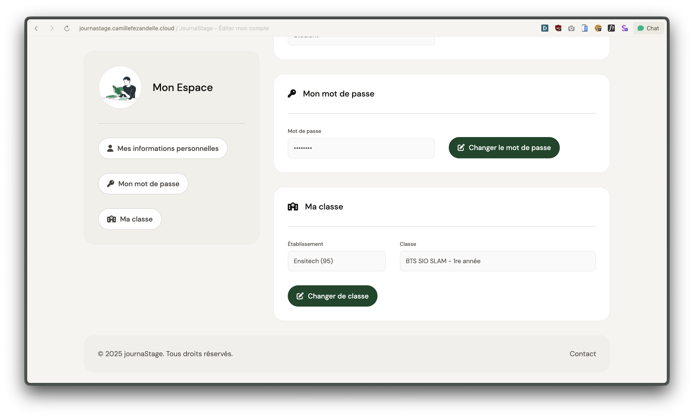
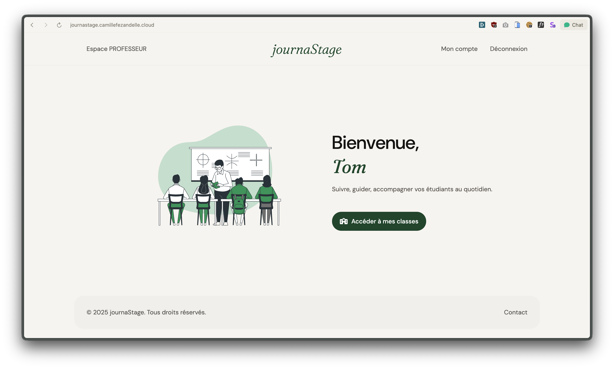
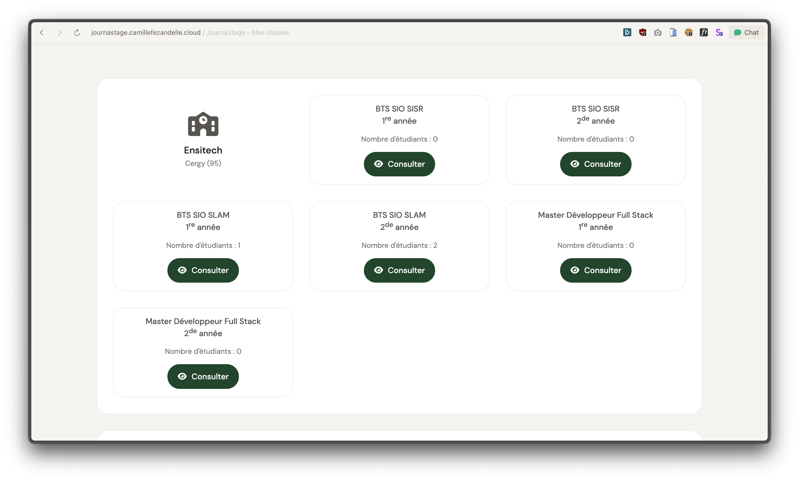
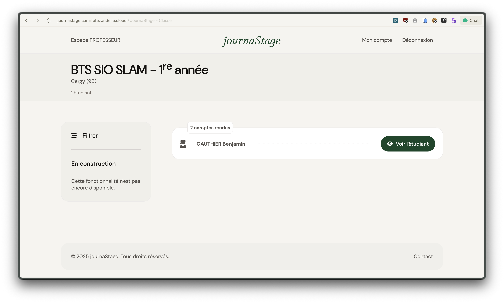
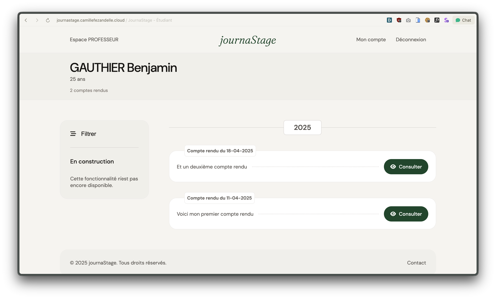
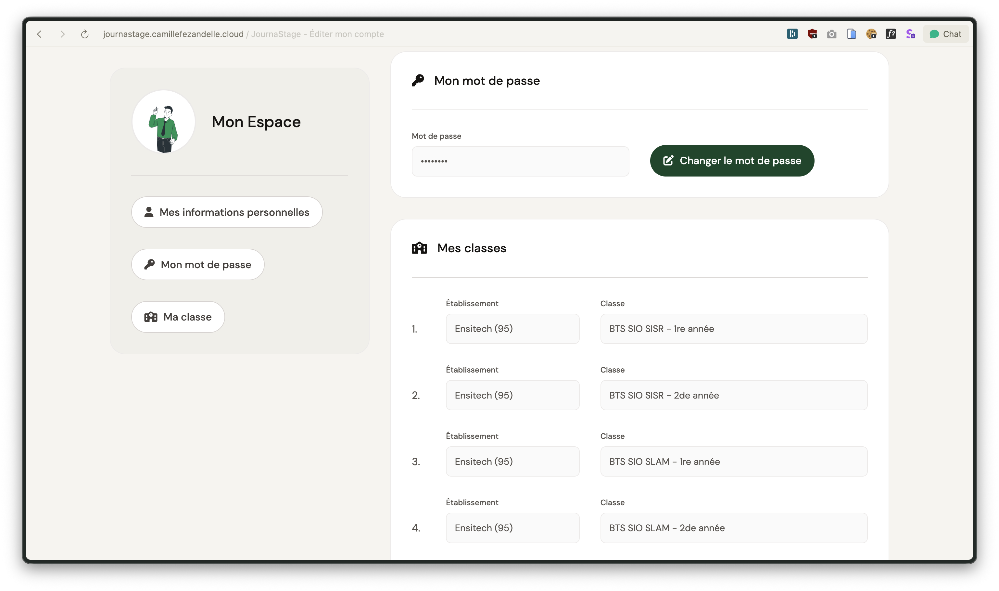

---

## 👨‍💻 Auteur

**Camille Fezandelle**  
Étudiant en **BTS SIO – SLAM (Solutions Logicielles et Applications Métiers)**  
[Portfolio](https://camillefezandelle.cloud)
